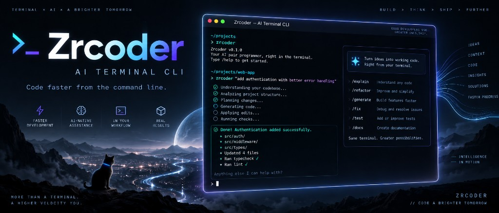

# Zrcoder

<p align="center">
  
</p>

终端里的编程助手：连 OpenAI 兼容 API，可读写文件、执行命令，并支持斜杠命令与会话恢复。

## 安装

需要 Python **3.12+**。推荐用 [uv](https://docs.astral.sh/uv/)：

```bash
uv tool install zrcoder
```

也可用 pipx / pip：

```bash
pipx install zrcoder
# 或
pip install zrcoder
```

## 配置

设置环境变量，或在以下位置之一创建 `.env`（可参考 `.env.example`）：

- 当前目录：`./.env`
- 用户配置：`~/.config/zrcoder/.env`
- 兼容路径：`~/.zrcoder.env`

```bash
export API_KEY=your_api_key
export BASE_URL=https://api.example.com/v1
# 可选，默认 deepseek-v4-flash
# export MODEL_NAME=deepseek-v4-flash
```

## 使用

```bash
zrcoder
```

常用命令：`/help`、`/status`、`/new`、`/resume`、`/api-detail`、`/exit`。

## 变更与发版

- 用户可见变更：[CHANGELOG.md](CHANGELOG.md)
- 维护者发版流程：[RELEASING.md](RELEASING.md)

## 从源码开发

```bash
git clone https://github.com/ZRMYDYCG/ClaudeCode.git
cd ClaudeCode
uv sync --group dev

uv run zrcoder
# 或
uv run python main.py

uv run ruff format .
uv run ruff check --fix .
uv run pytest
uv run mypy core
```

## License

MIT
